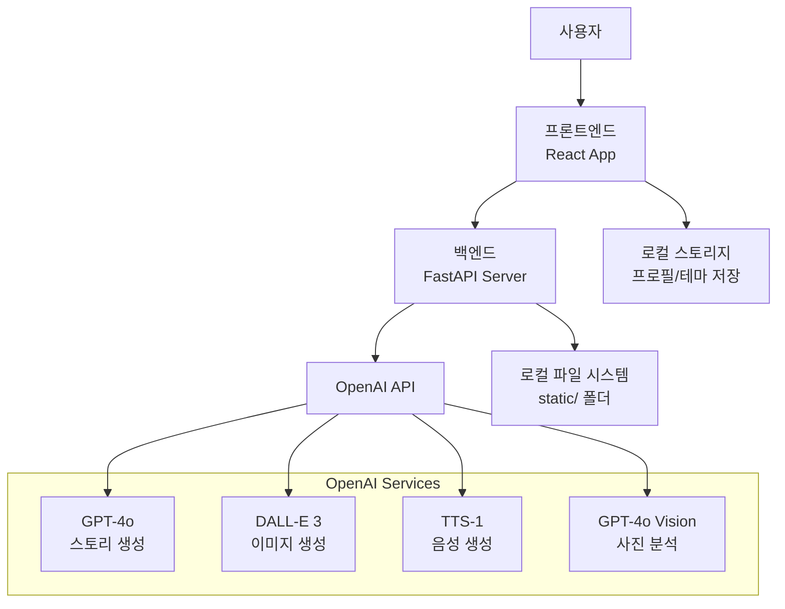
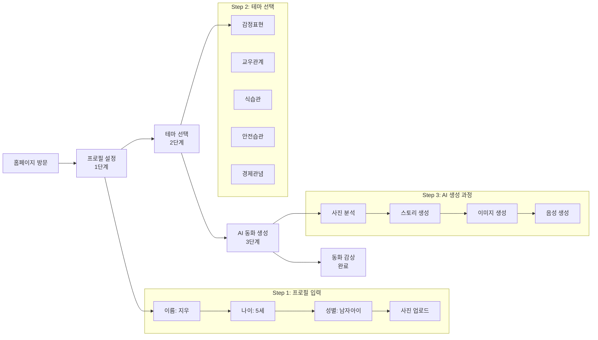

# 🧚‍♀️ FaiRY TALE - 우리아이만의 동화책

## 1. 프로젝트 소개

**AI 기반 개인화 아동 교육 동화 생성 시스템**

FaiRY TALE은 OpenAI의 최신 AI 기술을 활용하여 아이 개인의 특성에 맞춘 교육 동화를 자동 생성하는 서비스입니다. 아이의 이름, 나이, 성별, 사진을 입력하면 AI가 6개 장면으로 구성된 완전한 동화책(삽화 + 스토리 + 음성)을 3-5분 내에 제작합니다.

## 2. 프로젝트 주제

**"개인화된 AI 교육 동화로 아이의 올바른 성장 돕기"**

- **개인화**: 아이 개별 특성을 반영한 맞춤형 캐릭터
- **교육성**: 5가지 핵심 생활습관 테마 기반 학습
- **접근성**: 3단계 간단한 프로세스로 누구나 쉽게 이용
- **혁신성**: 최신 AI 기술로 실시간 고품질 콘텐츠 생성

## 3. 핵심 타겟

### 주요 타겟: 바쁜 현대사회의 맞벌이 부모

- **3-7세 자녀**를 둔 부모님
- **시간 부족**으로 아이와 충분한 교육 시간을 갖지 못하는 가정
- **개인화된 교육 콘텐츠**를 원하는 부모님
- **디지털 네이티브** 세대 부모들

### 해결하는 문제

- 시중 동화책의 획일화된 내용
- 개별 아이 특성을 반영하지 못하는 교육 자료
- 바쁜 일상으로 인한 교육 시간 부족
- **AI로 개인 맞춤형 교육 동화 즉시 생성**

## 4. 사용 모델 및 기술 스택

### 🤖 AI 모델

- **GPT-4o**: 창의적이고 교육적인 동화 스토리 생성
- **GPT-4o Vision**: 업로드된 아이 사진 분석 및 특징 추출
- **DALL-E 3**: 고품질 일러스트레이션 이미지 생성
- **TTS-1 (Nova)**: 자연스러운 한국어 음성 생성

### 💻 기술 스택

#### 프론트엔드

- **React** + **TypeScript**: 타입 안전한 UI 개발
- **Tailwind CSS**: 유틸리티 기반 반응형 디자인
- **React Router v6**: SPA 라우팅
- **Context API**: 전역 상태 관리

#### 백엔드

- **FastAPI**: 고성능 Python 웹 프레임워크
- **Pydantic**: 강력한 데이터 검증
- **OpenAI API**: AI 모델 통합
- **Uvicorn**: ASGI 서버

## 5. 핵심 기능

### 개인화 입력 시스템

- **아이 이름**: 개인화된 스토리 주인공 설정
- **나이 선택**: 3~7세 연령별 맞춤 콘텐츠
- **성별 선택**: 캐릭터 외형 및 스토리 조정
- **사진 업로드**: AI 얼굴 분석으로 닮은 캐릭터 생성

### 교육 테마 시스템 (5가지)

- **감정표현**: 감정 이해 및 올바른 표현 방법
- **교우관계**: 친구 사귀기와 갈등 해결
- **식습관 개선**: 균형잡힌 식단과 건강한 식습관
- **안전습관**: 일상생활 안전수칙 학습
- **경제관념**: 용돈 관리와 저축의 중요성

### AI 생성 콘텐츠

- **6개 장면 구성**: 기승전결이 있는 완성된 스토리
- **일관된 캐릭터**: 모든 장면에서 동일한 주인공 유지
- **고품질 삽화**: DALL-E 3 기반 수채화 스타일 일러스트
- **TTS 음성**: 각 장면별 자연스러운 한국어 나레이션

## 시스템 아키텍처

### 전체 구조

```
FaiRY TALE/
├── frontend/              # React 프론트엔드
│   ├── src/
│   │   ├── pages/         # 4개 주요 페이지 (Home, Profile, ThemeSelection, StoryGeneration)
│   │   ├── components/    # 재사용 컴포넌트 (common, layout)
│   │   ├── services/      # API 통신 (api.ts, apiClient.ts)
│   │   ├── context/       # 상태 관리 (AppContext)
│   │   ├── hooks/         # 커스텀 훅
│   │   ├── types/         # TypeScript 타입 정의
│   │   └── utils/         # 유틸리티 함수
│   └── public/           # 정적 자원 (SVG 아이콘, 이미지)
├── backend/              # FastAPI 백엔드
│   ├── demo_main.py      # FastAPI 메인 애플리케이션
│   ├── start.py          # 서버 시작 스크립트
│   ├── config.py         # 설정 관리
│   ├── models.py         # Pydantic 데이터 모델
│   ├── openai_service.py # OpenAI API 연동 서비스
│   └── static/           # 생성된 오디오/이미지 파일
│       ├── audio/        # TTS 음성 파일 (MP3)
│       └── images/       # DALL-E 생성 이미지
└── start.sh             # 자동 실행 스크립트
```

### 시스템 흐름도



## 6. 화면 설계

### 📱 4개 주요 화면 구성

#### 1️⃣ 홈 페이지 (`/`)

- **목적**: 서비스 소개 및 사용자 유입
- **디자인**: 그라데이션 배경, 플로팅 애니메이션
- **핵심 요소**:
  - 프로젝트 개요 및 특징 설명
  - 3단계 프로세스 안내
  - "동화 만들기 시작" CTA 버튼

#### 2️⃣ 프로필 설정 (`/profile`)

- **목적**: 아이의 기본 정보 수집
- **입력 요소**:
  - 이름 입력 (실시간 검증, 10자 이내)
  - 나이 선택 (3~7세 이모지 버튼: 🍼🧸🎈🎨📚)
  - 성별 선택 (왕자님/공주님 아이콘)
  - 사진 업로드 (드래그앤드롭, 즉시 미리보기)

#### 3️⃣ 테마 선택 (`/theme`)

- **목적**: 교육 테마 선택
- **UI**: 5가지 테마 카드 형태 표시
- **기능**: 호버 효과, 선택 상태 시각화
- **테마**: 감정표현, 교우관계, 식습관, 안전습관, 경제관념

#### 4️⃣ 동화 생성 및 재생 (`/story`)

- **생성 단계**: 실시간 로딩 메시지
- **재생 기능**:
  - 6개 장면 슬라이드 뷰어
  - TTS 오디오 재생/일시정지 컨트롤
  - 페이지 인디케이터

## 7. 유스케이스



### 📋 주요 사용 시나리오

1. **일반적 사용**: 퇴근 후 아이와 함께 개인화된 동화 생성 및 감상
2. **교육적 사용**: 특정 행동 교정이 필요할 때 관련 테마로 동화 생성
3. **재미요소**: 아이 생일이나 특별한 날 맞춤 동화 선물
4. **반복 사용**: 다양한 테마로 여러 편의 동화 생성

## 8. DB 설계

### 🗃️ 데이터 저장 구조

#### 프론트엔드 (브라우저 localStorage)

```json
{
  "childProfile": {
    "name": "지우",
    "age": 5,
    "gender": "boy",
    "photo": "data:image/jpeg;base64,..."
  },
  "selectedTheme": "감정표현",
  "currentStory": {
    "title": "지우의 감정 여행",
    "scenes": [
      {
        "scene_number": 1,
        "text": "스토리 내용...",
        "image_url": "URL",
        "audio_url": "/static/audio/scene_1_지우_timestamp.mp3"
      }
    ]
  }
}
```

#### 백엔드 (파일 시스템)

```
backend/static/
├── audio/          # TTS 생성 음성 파일
│   ├── scene_1_지우_1755662146.mp3
│   ├── scene_2_지우_1755662148.mp3
│   └── ...
└── images/         # DALL-E 3 생성 이미지
    ├── character_지우_1755662140.png
    └── scene_1_지우_1755662142.png
```

### 📊 데이터 모델 (Pydantic)

```python
class ChildProfile(BaseModel):
    name: str
    age: int  # 3-7
    gender: str  # "boy" | "girl"
    photo: Optional[str] = None

class StoryScene(BaseModel):
    scene_number: int
    text: str
    image_url: Optional[str] = ""
    audio_url: Optional[str] = ""

class Story(BaseModel):
    title: str
    scenes: List[StoryScene]
```

## 9. 프로젝트 이슈 및 해결 과정

### 🎯 핵심 기술적 도전과제

#### 1️⃣ 삽화 캐릭터 일관성 문제

**문제**: DALL-E 3에서 장면마다 다른 캐릭터가 생성되는 일관성 부족
**해결 과정**:

- **시도 1**: 동일한 프롬프트 반복 사용 → 실패 (여전히 다른 캐릭터)
- **시도 2**: Reference Image + Edit API 활용 → 부분적 성공
- **시도 3**: Gen ID 기반 참조 시스템 구현 → 성공
- **최종 해결**: 프롬프트 엔지니어링 + 캐릭터 디스크립션 고도화

#### 2️⃣ 모델 선정 및 성능 최적화

**고려사항**:

- **GPT-4o vs GPT-4o-mini**: 창의성 vs 비용 효율성
- **DALL-E 3 vs Midjourney**: API 지원 vs 품질
- **TTS-1 vs 외부 TTS**: 통합성 vs 한국어 발음 품질

**최종 선택 근거**:

- GPT-4o: 높은 창의성과 교육적 콘텐츠 생성 능력
- DALL-E 3: OpenAI 생태계 통합과 안정적인 API
- TTS-1 Nova: 자연스러운 한국어 발음

#### 3️⃣ 실시간 생성 과정의 UX 문제

**문제**: 3-5분 대기시간 동안 사용자 이탈 우려
**해결책**:

- 실시간 로딩 메시지 (2초마다 업데이트)
- 진행 단계별 상세 안내
- 예상 완료 시간 표시

## 10. 기대 효과

### 🎯 사회적 기대 효과

#### 교육적 가치

- **개인화 학습**: 아이별 맞춤형 교육 콘텐츠 제공
- **흥미 유발**: 본인이 주인공인 동화로 높은 몰입도
- **반복 학습**: 다양한 테마로 지속적인 교육 효과
- **가족 유대감**: 부모-자녀 함께하는 디지털 스토리텔링

#### 사회적 영향

- **교육 격차 해소**: AI 기술로 양질의 교육 콘텐츠 민주화
- **디지털 리터러시**: 차세대를 위한 AI 친화적 교육 환경
- **콘텐츠 산업 혁신**: 전통적 출판업계의 디지털 전환 촉진

### 경제적 기대 효과

#### 비용 효율성

- **기존 대비 90% 비용 절감**: 기존 맞춤형 동화 제작 대비
- **시간 단축**: 몇 개월 → 3-5분 내 제작 완료
- **확장성**: 무제한 콘텐츠 생성 가능

#### 시장 잠재력

- **국내 시장**: 만 3-7세 자녀를 둔 가정 약 200만 가구
- **해외 진출**: 다국어 확장을 통한 글로벌 시장 진출
- **B2B 확장**: 유치원, 어린이집 등 교육기관 대상 서비스

## 11. 후기 및 회고

### 🎓 기술적 성장

#### 새로운 기술 습득

- **OpenAI API 마스터**: GPT-4o, DALL-E 3, TTS-1 통합 경험
- **프롬프트 엔지니어링**: 효과적인 AI 프롬프트 설계 노하우
- **TypeScript + React**: 대규모 프론트엔드 프로젝트 개발
- **FastAPI**: 고성능 Python 백엔드 아키텍처 구축

#### 문제 해결 역량 향상

- **캐릭터 일관성**: 창의적 해결책으로 기술적 한계 극복
- **UX 최적화**: 긴 대기시간을 흥미로운 경험으로 전환
- **성능 튜닝**: API 비용과 품질의 균형점 찾기

### 💡 프로젝트 인사이트

#### 성공 요인

1. **명확한 타겟**: 바쁜 맞벌이 부모의 니즈 정확히 파악
2. **기술적 도전**: 최신 AI 기술의 한계를 창의적으로 해결
3. **사용자 중심**: 아이들 눈높이에 맞춘 UI/UX 설계
4. **완성도**: MVP가 아닌 실제 사용 가능한 수준의 완성품

#### 아쉬운 점

- **비용 최적화**: DALL-E 3 비용으로 인한 이미지 생성 제한
- **저장 기능**: 생성된 동화의 영구 보관 기능 부재
- **소셜 기능**: 동화 공유 및 커뮤니티 기능 미구현

### 🚀 향후 발전 방향

#### 단기 목표 (3개월)

- PWA 지원으로 모바일 앱 경험 제공
- 동화 저장 및 북마크 기능 추가
- 사용자 피드백 시스템 구축

#### 중기 목표 (6개월)

- 다국어 지원 (영어, 중국어, 일본어)
- B2B 서비스 (유치원, 어린이집 대상)
- 고급 캐릭터 커스터마이징 기능

#### 장기 목표 (1년)

- AI 모델 파인튜닝으로 한국 문화 특화
- 음성 인식 기반 인터랙티브 동화
- AR/VR 기술 접목한 몰입형 경험

### 최종 소감

FaiRY TALE 프로젝트는 단순한 기술 구현을 넘어 **'AI가 어떻게 인간의 창의성과 교육에 기여할 수 있는가'**에 대한 실질적인 답을 제시한 의미 있는 경험이었습니다.

특히 캐릭터 일관성 문제를 해결하는 과정에서 AI의 한계와 가능성을 동시에 깨달았으며, 기술적 도전을 통해 더 나은 사용자 경험을 만들어낼 수 있다는 확신을 얻었습니다.

**"기술은 도구일 뿐, 진정한 가치는 그것을 통해 만들어지는 인간의 경험에 있다"**는 것을 다시 한번 느낀 프로젝트였습니다.

## 버전 히스토리

### v1.0.0 (현재 버전)

- ✅ 4개 페이지 완전 구현
- ✅ 5개 교육 테마 완성
- ✅ OpenAI API 완전 통합
- ✅ TTS 음성 재생 기능
- ✅ 반응형 디자인 완료
- ✅ TypeScript 완전 적용

### 향후 계획 (v1.1.0)

- [ ] PWA 지원 (오프라인 모드)
- [ ] 동화 저장 및 북마크 기능
- [ ] 다국어 지원 (영어, 중국어)
- [ ] 사용자 피드백 시스템
- [ ] 고급 캐릭터 커스터마이징
- [ ] 부모님의 목소리 선택 가능 기능
