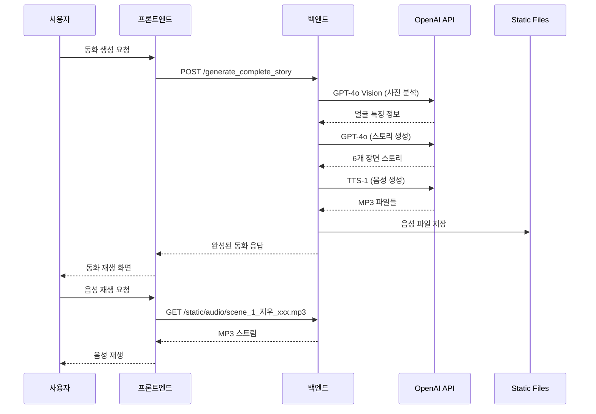

# FaiRY TALE 시스템 아키텍처 및 데이터 플로우

## 유스케이스 기반 시스템 작동 흐름

### **Step 1: 프로필 설정** (`/profile`)

#### 프론트엔드 동작

```typescript
// Profile.tsx
const profileData = {
  name: "지우",
  age: 5,
  gender: "boy",
  photo: "data:image/jpeg;base64,...",
};

// LocalStorage 저장
localStorage.setItem("childProfile", JSON.stringify(profileData));
```

#### 백엔드 연동 (사진 업로드)

```http
POST http://localhost:8000/upload_photo
Content-Type: multipart/form-data

file: [이미지 파일]
```

**엔드포인트**: `POST /upload_photo`
**응답**:

```json
{
  "image_url": "http://localhost:8000/static/images/profile_12345.jpg",
  "message": "사진이 성공적으로 업로드되었습니다.",
  "file_info": {
    "filename": "profile_12345.jpg",
    "size": 45231
  }
}
```

---

### **Step 2: 테마 선택** (`/theme`)

#### 프론트엔드 요청

```typescript
// ThemeSelection.tsx
const themes = await apiService.getThemes();
```

#### 백엔드 API

```http
GET http://localhost:8000/themes
```

**엔드포인트**: `GET /themes`
**응답**:

```json
{
  "themes": [
    {
      "value": "healthy_eating",
      "title": "식습관 개선",
      "emoji": "🥕",
      "label": "🥕 식습관 개선",
      "description": "균형 잡힌 영양 섭취의 중요성을 배워요",
      "examples": ["🥬 채소 친구들의 모험", "🍎 과일 왕국 여행"]
    }
  ]
}
```

---

### **Step 3: AI 동화 생성** (`/story`)

#### 프론트엔드 요청

```typescript
// StoryGeneration.tsx
const storyRequest: StoryRequest = {
  child_profile: {
    name: "지우",
    age: 5,
    gender: "boy",
    photo: "data:image/jpeg;base64,...",
  },
  theme: "healthy_eating",
};

const response = await apiService.generateCompleteStory(storyRequest);
```

#### 백엔드 메인 API

```http
POST http://localhost:8000/generate_complete_story
Content-Type: application/json

{
  "child_profile": {
    "name": "지우",
    "age": 5,
    "gender": "boy",
    "photo": "data:image/jpeg;base64,..."
  },
  "theme": "healthy_eating"
}
```

**엔드포인트**: `POST /generate_complete_story`

---

## **백엔드 AI 처리 파이프라인**

### 1️⃣ **사진 분석** (GPT-4o Vision)

```python
# openai_service.py:analyze_child_photo()
facial_features = await openai_service.analyze_child_photo(photo_data)
# 결과: "둥근 얼굴, 밝은 미소, 검은 머리카락..."
```

### 2️⃣ **스토리 생성** (GPT-4o)

```python
# openai_service.py:generate_story_with_gpt4o_mini()
story_data = await openai_service.generate_story_prompt(
    child_name="지우",
    child_age=5,
    child_gender="boy",
    theme="식습관 개선",
    facial_features=facial_features
)
# 결과: 6개 장면의 동화 + 이미지 프롬프트
```

### 3️⃣ **이미지 생성** (DALL-E 3)

```python
# openai_service.py:generate_scene_images()
for scene in story.scenes:
    image_url = await openai_service.generate_image(scene.image_prompt)
    scene.image_url = image_url
```

### 4️⃣ **음성 생성** (TTS-1)

```python
# openai_service.py:generate_audio_for_scenes()
for scene in story.scenes:
    audio_file = await openai_service.generate_audio(scene.text, child_name)
    scene.audio_url = f"/static/audio/scene_{scene.scene_number}_{child_name}_{timestamp}.mp3"
```

---

## 📂 **파일 저장 구조**

### 백엔드 Static 폴더

```
backend/static/
├── audio/
│   ├── scene_1_지우_1755662146.mp3  # TTS 음성 파일
│   ├── scene_2_지우_1755662148.mp3
│   └── ...
└── images/
    ├── character_지우_1755662140.png  # 캐릭터 이미지 (선택적)
    └── scene_1_지우_1755662142.png    # 장면 이미지 (선택적)
```

---

## **최종 응답 데이터**

**엔드포인트**: `POST /generate_complete_story`
**응답**:

```json
{
  "story": {
    "title": "지우의 건강한 음식 탐험",
    "scenes": [
      {
        "scene_number": 1,
        "text": "지우는 오늘 아침 식탁에 앉았어요. 하지만 채소들이 가득한 접시를 보고 고개를 저었어요.",
        "image_url": "data:image/png;base64,iVBOR...",
        "audio_url": "/static/audio/scene_1_지우_1755662146.mp3"
      }
    ]
  },
  "character_image": "data:image/png;base64,iVBOR...",
  "total_scenes": 6
}
```

---

## **주요 API 엔드포인트 요약**

| 엔드포인트                 | 메소드 | 목적             | 사용 시점        |
| -------------------------- | ------ | ---------------- | ---------------- |
| `/`                        | GET    | 서버 상태 확인   | 앱 시작시        |
| `/themes`                  | GET    | 테마 목록 조회   | 테마 선택 페이지 |
| `/upload_photo`            | POST   | 사진 업로드      | 프로필 설정시    |
| `/generate_complete_story` | POST   | 완전한 동화 생성 | 동화 생성시      |
| `/health`                  | GET    | 헬스체크         | 모니터링         |
| `/static/audio/*`          | GET    | 음성 파일 서빙   | 동화 재생시      |
| `/static/images/*`         | GET    | 이미지 파일 서빙 | 동화 표시시      |

---

## ⚡ **실시간 처리 플로우**



---

## **기술 스택별 역할**

### 프론트엔드 (React + TypeScript)

- **라우팅**: React Router로 4개 페이지 관리
- **상태관리**: Context API + localStorage
- **API 통신**: Axios 기반 apiClient
- **UI/UX**: Tailwind CSS + Framer Motion 애니메이션

### 백엔드 (FastAPI + Python)

- **API 서버**: FastAPI로 RESTful API 제공
- **AI 통합**: OpenAI API 연동 서비스
- **파일 관리**: Static 파일 서빙 (음성/이미지)
- **데이터 검증**: Pydantic 모델

### AI 서비스 (OpenAI)

- **GPT-4o Vision**: 아이 사진 얼굴 특징 분석
- **GPT-4o**: 교육적 동화 스토리 생성
- **DALL-E 3**: 일관된 캐릭터 이미지 생성 (선택적)
- **TTS-1**: 자연스러운 한국어 음성 생성

---

## **데이터 흐름 요약**

1. **사용자 입력** → 프론트엔드 폼 → localStorage 저장
2. **테마 선택** → GET /themes → 테마 목록 표시
3. **동화 생성 요청** → POST /generate_complete_story
4. **AI 처리**:
   - 사진 분석 (GPT-4o Vision)
   - 스토리 생성 (GPT-4o)
   - 음성 생성 (TTS-1)
   - 파일 저장 (backend/static/)
5. **완성된 동화** → 프론트엔드 → 사용자 재생

이 구조로 **3-5분 내에** 완전한 개인화 동화가 생성되어 사용자에게 제공됩니다.
